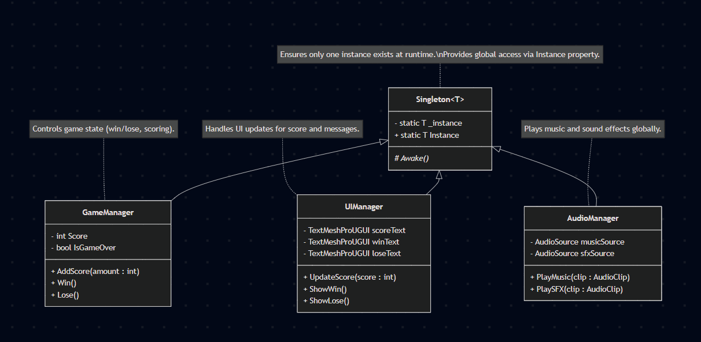

### Arshiya Shahbazpourtazehkand 100832558
#### **What system within your project uses a Singleton, and why did you choose this system to adopt the pattern?  Do you think this design pattern is beneficial for this purpose? Explain why or why not.**  
the project uses Singletons for GameManager, UIManager and AudioManager (the central systems that need one global,   
easy-to-access instance). I chose to make these systems singleton because there is only one instance of them required at a time and they provide a 
persistent global access to their services and streamline the logic.  
Singleton was useful in this project because systems like the GameManager, UIManager, and AudioManager need to exist only once and be accessible from anywhere in the game.  
Theoretically the systems could have been fully implemented fully without the use of the singleton pattern but that would come at the cost of complexity and repeated code. As well as an increased risk of  
management of these resources built duplicated and creating potential unwanted behaviour. However I also believe if too many singletons can make classes harder to reuse or test.  
Also in an event where we want to extend the game to support multiple sessions or different UI systems running at the same time the design pattern has to be scraped and refactored. 

## Geometry Stomp
The gameplay Loop conistst of avoiding gaps in the floor and the enemies. You can kill the enemies by jumping on them and "stomping" them. Collecting fruits will increase your score and you will win if you have reach the required score.

### UML class diagram 

